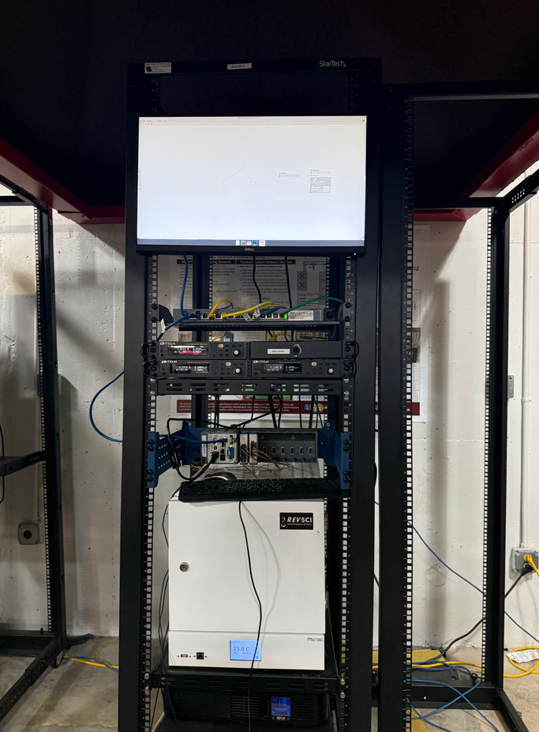

# V0.1

* Simplified three cell in parallel setup desinged to work with the NHR.
* No temperatue chamber is used for this setup, cells test in abminet contions on a shelf.

  
   
  <em>Figure 1. Test setup.</em>

